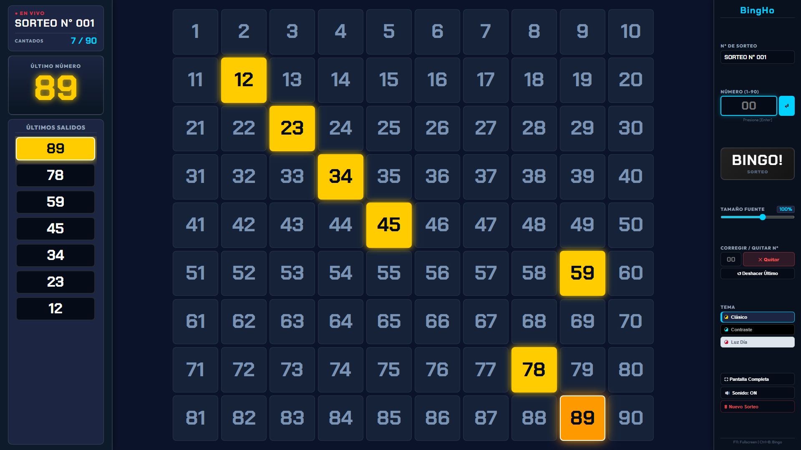

# 🎟️ BingHo

[-00d2ff)](https://github.com/hernancussit/BingHo/releases)

**BingHo** es un sistema profesional, moderno y gratuito para la gestión, control y proyección en tiempo real de tableros de Bingo (números del 1 al 90). Diseñado específicamente para eventos presenciales, salones de fiestas, festivales, clubes deportivos, peñas benéficas, escuelas, transmisiones en vivo (streaming) y pantallas LED de gran formato.

### 🎮 Tablero Principal y Control de Sorteo

### 🏆 Celebración y Festejo de Cartón Ganador

---

## ☕ Apoya el Proyecto

Si **BingHo** te ha sido de utilidad para tus sorteos o eventos y deseas colaborar con su desarrollo continuo y futuras mejoras, ¡puedes invitarme un cafecito!

👉 **[Apoyar en Cafecito (cafecito.app/henu_45)](https://cafecito.app/henu_45)**

---

## 🌟 Características y Funcionalidades

### 🖥️ Modo Segunda Pantalla (Proyector / Pantalla Extendida)
- Permite proyectar en un segundo monitor, proyector o pantalla gigante LED utilizando el **modo escritorio extendido de Windows**.
- La ventana de proyección muestra exclusivamente el panel informativo y el tablero 1 al 90 maximizados al **100% del espacio visual**, ocultando todos los controles del operador para una visualización limpia e ininterrumpida.
- Sincronización instantánea y sin latencia entre el operador y el proyector.
- Atajo rápido: **`[F10]`**.

### 🏆 Festejo de Cartón Ganador
- Superposición de celebración a pantalla completa para premiar al ganador con máximo impacto visual.
- **Efectos estroboscópicos de flash**, haces de luz dorados y esmeralda giratorios de fondo, lluvia de confeti y fuegos artificiales a 60 FPS.
- Fanfarria triunfal sintetizada de victoria.
- Sincronización automática en ambas pantallas y visualización limpia en el proyector (sin botones visibles para el público).
- Atajo rápido: **`[Ctrl + W]`** (durante el modo auditoría).

### 🔍 Modo Auditoría BINGO en Tiempo Real
- Permite verificar y auditar cartones ganadores de forma inmediata:
  - Los números correctos cantados se destacan en **verde con zoom dinámico**.
  - Los números erróneos o no cantados alertan en **rojo**.
  - Los números auditados permanecen resaltados durante toda la revisión del cartón.
- **Corrección en Auditoría**: Permite desmarcar números auditados por error usando el botón **Quitar** o **Deshacer Auditado (`Ctrl+Z`)** sin alterar los números cantados del sorteo.
- Atajo rápido: **`[Ctrl + B]`**.

### ⚡ Auto-Actualizador In-App 100% Automático
- Consulta automáticamente nuevas versiones publicadas en GitHub.
- **Descarga e instalación con un solo clic**: Descarga la actualización en segundo plano con una barra de progreso en tiempo real y reinicia BingHo automáticamente con la nueva versión sin requerir pasos manuales.

### 🎚️ Ajuste de Escala de Fuente (60% al 130%)
- Control deslizante para calibrar en vivo el tamaño de los números del tablero.
- Permite adaptar la grilla perfectamente a cualquier relación de aspecto o resolución de pantalla (4:3, 16:9, 16:10, ultrawide o pantallas LED personalizadas).

### 🎨 3 Temas Visuales Profesionales
- **Clásico**: Azul marino profundo y acentos dorados/amarillos de alta visibilidad.
- **Alto Contraste**: Fondo negro absoluto con tipografía cian y blanca, ideal para pantallas OLED o paneles LED en exteriores.
- **Luz de Día**: Fondo claro con azul rey profundo, optimizado para evitar cualquier interferencia con los colores verde y rojo de auditoría.

### 🔊 5 Perfiles de Sonido Sintetizado y Modo Silencio
- Menú desplegable para seleccionar el ambiente sonoro adecuado para tu evento:
  - 🔔 **Clásico**: Campanillas de bolillero y fanfarria tradicional.
  - 👾 **Arcade / 8-Bit**: Efectos retro y melodía chip-tune.
  - 🪵 **Marimba Suave**: Sonidos de madera acústicos y cálidos.
  - ✨ **Digital / Pop**: Tono pop moderno y campanillas festivas.
  - 🛎️ **Campanilla**: Campanas cristalinas y ding metálico.
  - 🔇 **Sin Sonido**: Silencio absoluto para sorteos con locutor en vivo.

### 🔒 Tablero Protegido y Corrección Inline Dinámica
- Las celdas del tablero principal están bloqueadas a clics directos para prevenir marcaciones accidentales.
- Panel de corrección rápida para quitar números ingresados por error o deshacer el último número (`Ctrl+Z`), adaptándose automáticamente al modo Sorteo o al modo Auditoría.

### 🛡️ Control de Instancia Única y Gestión de Procesos
- Evita la apertura accidental de múltiples instancias simultáneas de BingHo.
- Diálogo inteligente con botón **"Cerrar"** que termina procesos residuales en segundo plano si los archivos estuviesen bloqueados.

### 💾 Persistencia Anti-Cierre (Protección Total de Datos)
- Todo el estado del sorteo (números cantados, título, tema, escala y sonido) se almacena continuamente en tiempo real.
- Si la aplicación o el equipo se cierra por accidente, al reabrir BingHo la partida continúa exactamente donde quedó.

### 🚀 Portabilidad Total (Single EXE de ~94 MB)
- Empaquetado como un **único archivo `.exe` portable**, optimizado y con dependencias integradas.
- No requiere instalación, instaladores pesados ni configuración de entornos adicionales. Listo para usar desde un pendrive o cualquier carpeta.

---

## ⌨️ Atajos de Teclado

| Tecla | Función |
| :--- | :--- |
| `[Enter]` | Cantar número (en modo Sorteo) o Validar número (en modo Auditoría) |
| `[Ctrl + Z]` | Deshacer último número cantado / Deshacer último número auditado |
| `[F10]` | Abrir / Cerrar Modo Segunda Pantalla (Proyector) |
| `[F11]` | Alternar Pantalla Completa |
| `[Ctrl + B]` | Activar / Desactivar Modo Auditoría BINGO |
| `[Ctrl + W]` | Activar Festejo de Cartón Ganador (en Modo Auditoría) |
| `[Esc]` | Cerrar cuadros de diálogo o superposición de ganador |

---

## 🚀 Inicio Rápido

1. **Descargar**: Obtén la última versión de **`BingHo.exe`** desde la sección de **[Releases](https://github.com/hernancussit/BingHo/releases)**.
2. **Ejecutar**: Haz doble clic sobre `BingHo.exe` para iniciar el sistema inmediatamente.
3. **Proyectar**: Presiona `F11` para pantalla completa en tu monitor o `F10` para abrir la proyección en pantalla secundaria.

---

## 🛡️ Aviso de Seguridad y Falsos Positivos (Disclaimer)

> [!NOTE]  
> **¿Por qué Windows SmartScreen o tu antivirus podrían mostrar una advertencia?**

Al ejecutar **`BingHo.exe`** por primera vez, Windows SmartScreen o algunos programas antivirus pueden mostrar una advertencia del tipo *"Windows protegió su PC"* o *"Editor desconocido"*.

### ¿Por qué ocurre esto?
1. **Falta de Certificado Comercial de Pago:**  
   BingHo es un proyecto independiente y de código abierto. Los certificados de firma de código comerciales (EV Code Signing) tienen un costo anual elevado de cientos de dólares, inviable para proyectos comunitarios gratuitos.
2. **Empaquetado Portable (.EXE):**  
   Al ser un ejecutable único que extrae e inicia el entorno de Electron de forma autónoma, los motores heurísticos de algunos antivirus pueden clasificarlo preventivamente como archivo desconocido.

### ¿Cómo ejecutar la aplicación con total seguridad?
- **En Windows SmartScreen:**  
  1. Haz clic en el enlace **"Más información"**.  
  2. Haz clic en el botón **"Ejecutar de todas formas"**.
- **En Windows Defender / Antivirus:**  
  - Permite la ejecución del archivo o agrégalo a la lista de exclusiones de confianza.

### 🔍 Código 100% Abierto y Auditable
Todo el código fuente de BingHo es **público, transparente y auditable**:
- Puedes revisar cada línea de código en este repositorio de GitHub: [https://github.com/hernancussit/BingHo](https://github.com/hernancussit/BingHo)
- Puedes compilar el proyecto por tu cuenta siguiendo las instrucciones del repositorio.
- Si detectas cualquier posible error, sugerencia o falla de seguridad, te invitamos a abrir un reporte en la pestaña de **[Issues](https://github.com/hernancussit/BingHo/issues)**.

---

## 👤 Autor y Créditos

Desarrollado con ❤️ por **Hernán Cussit**  
- GitHub: [@hernancussit](https://github.com/hernancussit)  
- Donaciones: [cafecito.app/henu_45](https://cafecito.app/henu_45)

---

## 📄 Licencia

Este proyecto está distribuido bajo los términos de la Licencia **[MIT](LICENSE)**.
